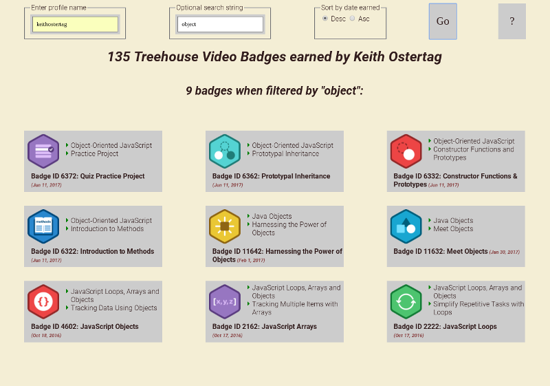

# Treehouse-badges
Exploring the Teamtreehouse badges json file for students

In order to use this web service you will need a valid teamtreehouse.com profile name (several are listed when clicking the info (?) button on the page). This page uses Jquery and Flexbox so may not work with older browsers. Uses Kyle Fox's jquery-modal (https://github.com/kylefox/jquery-modal) only for presenting the info page.

Enter the profile name (and an optional search string) then press "Go". The page may take several seconds to load if the user has earned many badges, so be patient.

#### Background
Users for Treehouse online tutorial videos are provided with a JSON file with data about the "badges" they have earned by completing courses. The JSON file is available at http://teamtreehouse.com/<profile_name>.json. For instance, since my profile_name is keithostertag, you can retrieve my file here: http://teamtreehouse.com/keithostertag.json.

It wasn't until nearing the end of writing this page that I discovered that Treehouse also provides this JSON data parsed at http://teamtreehouse.com/<profile_name> (no file extension). My page offers two features not available from the Treehouse page: the ability to sort the data by "earned_date" and the ability to filter the data by a string.

Filtering the data by a search string enables you to limit the badges displayed  to a subject or other related word/character strings (provided the string is included in the badge data!). Filtering the data by a string is particularly convenient if the user has many badges. The string input field is not case sensitive, but no other input validation/restriction is performed.

This page uses Google font Roboto, and only one Font Awesome icon (originally I had intended to use several so loading the set is kinda extravagant...)

#### Screenshot

